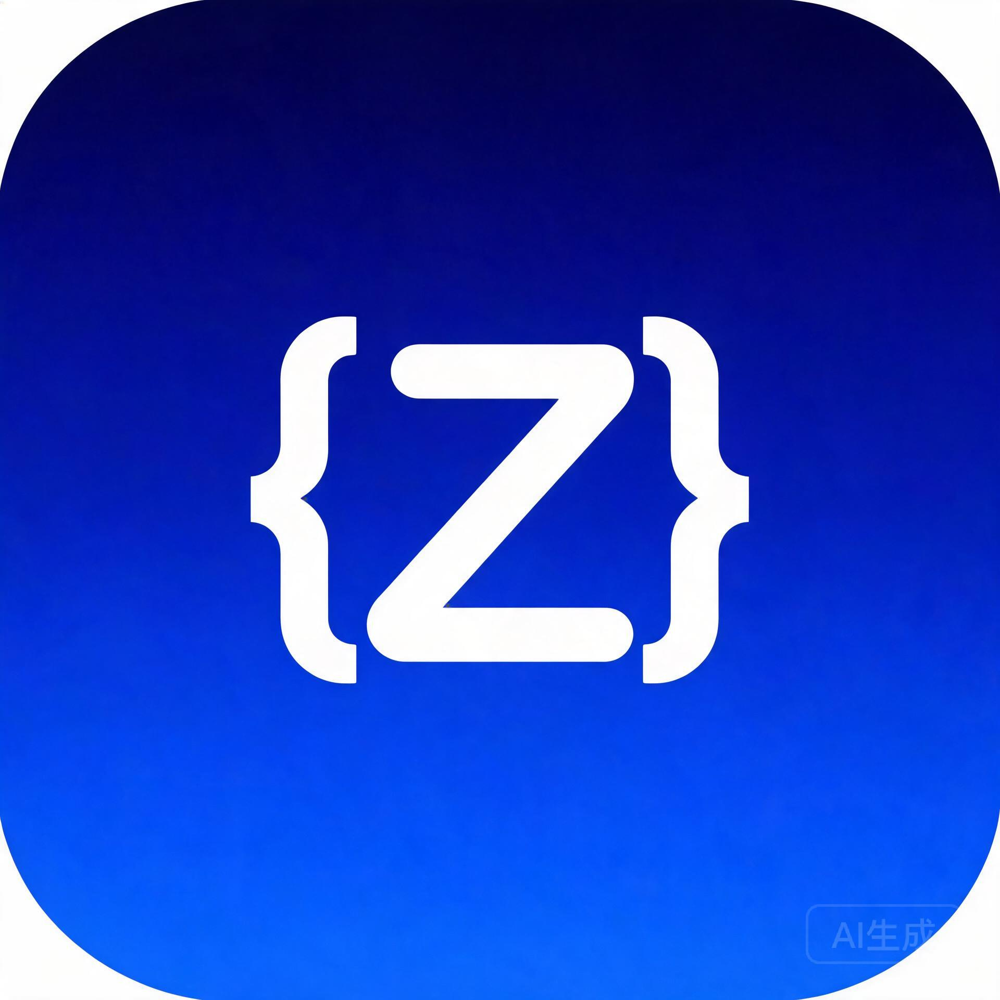

# ZCode

<div align="center">
  
</div>

<div align="center"><a href="README.md">简体中文</a></div>

ZCode is an AI coding workspace offering desktop, browser, and terminal `zcode` entry points, all sharing a single Agent runtime, protocol, and UI.

## Quick Start

Requirements: Git, Node.js **24.14.0**, pnpm **10.33.2** (see [mise.toml](mise.toml)).

```bash
pnpm bootstrap
```

`pnpm bootstrap` installs dependencies, prepares desktop runtime assets, and runs the basic build.

## Common Commands

| Command                                   | Purpose                                |
| ----------------------------------------- | -------------------------------------- |
| `pnpm dev:desktop`                        | Start the desktop app (Electron)       |
| `pnpm dev:desktop:test`                   | Start the desktop app with test config |
| `pnpm dev:web`                            | Start Web client and server            |
| `pnpm --filter @zcode/cli dev`            | Start the terminal Agent CLI           |
| `zcode` `zcode --web`                     | CLI distribution (TUI / Web mode)      |
| `pnpm bundle:desktop`                     | Package the desktop app                |
| `pnpm build:zcode`                        | Assemble the CLI distribution          |
| `pnpm typecheck` / `pnpm lint`            | Type check / lint                      |

## License

Released under the **Apache-2.0** license; see [LICENSE](LICENSE).